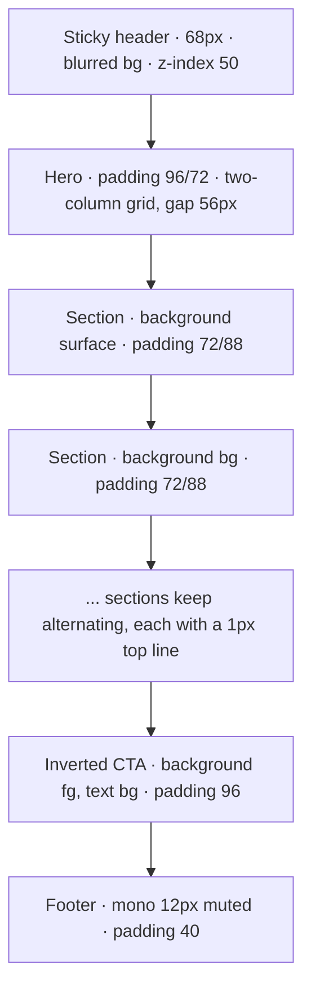
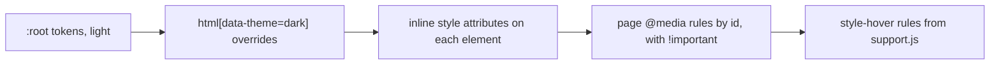

# CWA website style guide

This guide records the visual language the site already uses, so that new pages and sections match it. It is descriptive: every value below was measured from the seven pages (`index`, `start`, `spec`, `evidence`, `producers`, `assembler`, `about`) on 2026-09-28. When a page and this guide disagree, fix the page unless the page is one of the deliberate exceptions named in section 10.

The pages are Claude Design canvas exports. There is no external design system, no CSS framework and no shared stylesheet. Each page repeats the same token block inside its `<helmet>` `<style>` and styles every element inline. Read section 9 before editing markup.

## 1. Character

Warm, flat, typographic, hairline, editorial.

- **Paper, not white.** Backgrounds are warm off-white neutrals with a hint of yellow (OKLCH hue 80 to 90), never pure white or pure black. Dark mode is the same warm hue inverted.
- **One accent.** A single clay orange carries every emphasis: kickers, links, RFC keywords, the primary button. Nothing else is coloured except the four plane colours, which are semantic, never decorative.
- **Two typefaces with strict jobs.** Space Grotesk sets everything a reader reads. IBM Plex Mono sets everything a machine or a spec would say: labels, metadata, identifiers, code, counts, the footer.
- **Hairlines and squares.** Structure comes from 1px lines and 1px-gap grids, not from shadows, gradients or rounded cards. The only radius on the site is the pill on buttons and chips.
- **Big, tight display type.** Headlines run to 82px with negative tracking and line-heights below 1, balanced by generous section padding.
- **Almost no motion.** Hover states switch instantly. The only animation is a short rise-and-fade on items the assembler demo inserts.

## 2. Tokens

Every page declares the same custom properties on `:root`, with a dark override on `html[data-theme="dark"]`. Colours are authored in OKLCH; the hex columns are the sRGB values Chrome renders and exist only for handoff to tools that cannot read OKLCH.

| Token | Role | Light | Light hex | Dark | Dark hex |
|---|---|---|---|---|---|
| `--bg` | Page and card interiors | `oklch(0.985 0.004 90)` | `#fbfaf7` | `oklch(0.175 0.008 80)` | `#12100d` |
| `--surface` | Alternate section bands, quiet cards | `oklch(0.955 0.005 90)` | `#f1f0ec` | `oklch(0.215 0.008 80)` | `#1b1915` |
| `--fg` | Primary text, inverted panels | `oklch(0.20 0.010 80)` | `#181611` | `oklch(0.955 0.004 90)` | `#f1f0ed` |
| `--muted` | Secondary text, labels, nav at rest | `oklch(0.52 0.010 80)` | `#6c6863` | `oklch(0.68 0.010 85)` | `#9b9891` |
| `--line` | Every border and divider | `oklch(0.885 0.006 90)` | `#dad9d5` | `oklch(0.305 0.008 80)` | `#312f2b` |
| `--accent` | Emphasis, links, primary button | `oklch(0.60 0.20 38)` | `#dd4300` | `oklch(0.74 0.17 45)` | `#ff8244` |
| `--accent-soft` | Hover fills, note callouts | `oklch(0.94 0.035 45)` | `#ffe5d8` | `oklch(0.30 0.045 45)` | `#41261a` |
| `--p-gov` | Governance plane | `oklch(0.58 0.17 38)` | `#ca4b20` | `oklch(0.76 0.15 45)` | `#fe8f5b` |
| `--p-state` | State plane | `oklch(0.56 0.14 250)` | `#2378c3` | `oklch(0.76 0.12 250)` | `#73b6fa` |
| `--p-evid` | Evidence plane | `oklch(0.54 0.13 155)` | `#0d844c` | `oklch(0.76 0.13 155)` | `#65c98c` |
| `--p-inter` | Interaction plane | `oklch(0.54 0.15 310)` | `#8951af` | `oklch(0.76 0.13 310)` | `#ca99ef` |

Non-colour tokens:

| Token | Value |
|---|---|
| `--sans` | `'Space Grotesk', Helvetica, Arial, sans-serif` |
| `--mono` | `'IBM Plex Mono', monospace` |
| `--pill` | `999px` |

The fonts load from Google Fonts after two `preconnect` links: Space Grotesk at 400, 500, 600 and 700, and IBM Plex Mono at 400, 500 and 600. Do not request other weights; inline styles only ever use 500, 600 and 700 on top of the 400 default.

The block to copy into a new page, verbatim:

```css
:root {
  --sans: 'Space Grotesk', Helvetica, Arial, sans-serif;
  --mono: 'IBM Plex Mono', monospace;
  --pill: 999px;
  --bg: oklch(0.985 0.004 90);
  --surface: oklch(0.955 0.005 90);
  --fg: oklch(0.20 0.010 80);
  --muted: oklch(0.52 0.010 80);
  --line: oklch(0.885 0.006 90);
  --accent: oklch(0.60 0.20 38);
  --accent-soft: oklch(0.94 0.035 45);
  --p-gov: oklch(0.58 0.17 38);
  --p-state: oklch(0.56 0.14 250);
  --p-evid: oklch(0.54 0.13 155);
  --p-inter: oklch(0.54 0.15 310);
}
html[data-theme="dark"] {
  --bg: oklch(0.175 0.008 80);
  --surface: oklch(0.215 0.008 80);
  --fg: oklch(0.955 0.004 90);
  --muted: oklch(0.68 0.010 85);
  --line: oklch(0.305 0.008 80);
  --accent: oklch(0.74 0.17 45);
  --accent-soft: oklch(0.30 0.045 45);
  --p-gov: oklch(0.76 0.15 45);
  --p-state: oklch(0.76 0.12 250);
  --p-evid: oklch(0.76 0.13 155);
  --p-inter: oklch(0.76 0.13 310);
}
html { background: var(--bg); scroll-behavior: smooth; scroll-padding-top: 88px; }
body { margin: 0; background: var(--bg); color: var(--fg); font-family: var(--sans); -webkit-font-smoothing: antialiased; }
* { box-sizing: border-box; }
a { color: var(--accent); text-decoration: none; }
a:hover { color: var(--fg); }
::selection { background: var(--accent); color: var(--bg); }
@keyframes cwaRise { from { opacity: 0; transform: translateY(14px); } to { opacity: 1; transform: none; } }
```

The landing page uses `overflow-x: hidden` on `html` instead of `scroll-padding-top`. The `.thumbnail` WebP and the `__bundler_thumbnail` SVG template in `index.html` use rounded hex approximations of these tokens (`#faf8f5`, `#c9502a`, `#4a72b8`, `#3f8a5c`, `#8a5aa6`). They are for the canvas thumbnail only and are not tokens.

## 3. Colour usage

Reference every colour through `var()`. No page contains a literal colour outside the token block, the thumbnail template, the two `color-mix()` calls (the header background and the outline button on the inverted band), and the `accent` prop options in the landing page's canvas script.

- **`--bg` and `--surface` alternate by section.** The landing page runs bg, surface, bg, surface down the page, each section separated by a 1px `--line` top border. Card interiors inside a hairline grid are `--bg`; quieter cards and the slot rows in the demo are `--surface`.
- **`--fg` is for reading and for inversion.** Body text, headings, and the one inverted band (the "Adopt the spec" call to action, `background: var(--fg); color: var(--bg)`). It is also the border of the emphasis panel and of the bad-example panel.
- **`--muted` is the default for anything secondary.** It is the most used colour on the site: ledes, card body copy, nav links at rest, every label and kicker inside a card, the table of contents, the footer. A block is muted unless it is the one thing the reader must read next.
- **`--accent` is emphasis, never texture.** Section kickers, links, the RFC 2119 keywords, the primary button fill, the active tab underline, the current-page bar in the mobile nav, the note callout border, the tour kicker, text selection. Never as running text, never as a large fill other than the primary button.
- **`--accent-soft` is a fill only.** Hover fill on clickable grid cells and the background of the note callout.
- **`--line` is every border.** Section separators, card borders, hairline grid gutters, divider rows, dashed separators (`1px dashed var(--line)`), panel header underlines, the ghost button outline. Only three things ever use another border colour: the note callout (`--accent`), the emphasis and bad-example panels (`--fg`), and header buttons on hover (`--fg`).

### Plane colours

The four plane colours are the site's only other chroma and always mean the plane they are named for.

| Token | Plane | What the plane answers |
|---|---|---|
| `--p-gov` | Governance | Who may direct the model |
| `--p-state` | State | What is true right now |
| `--p-evid` | Evidence | What the model may ground on |
| `--p-inter` | Interaction | What has happened, and what is asked |

Where they appear, and nowhere else:

- The logo mark: a 2 by 2 grid, 18px square, 2px gap, in the order governance, state, evidence, interaction.
- Legend swatches: an 8px by 18px vertical bar next to a label.
- Slot rows in the assembler demo: a 3px left border on the full row, a 2px left border on nested detail, and the slot label text.
- Comment lines in the rendered payload view, and segments of the budget bar.

Do not use a plane colour for a status, a category or a chart series that is not a plane.

### Dark mode

The theme is an attribute, `data-theme="light"` or `"dark"`, on `<html>`. Each page reads `localStorage["cwa-theme"]` on load, defaults to `light`, and writes the choice back when the header toggle is pressed. The toggle's label names the theme you would switch to ("Dark" while light). Everything else follows from the token override, so a component that only uses tokens needs no dark-mode work. The header's translucent background uses `color-mix(in oklab, var(--bg) 88%, transparent)` so it adapts too. The landing page's canvas `accent` prop is pinned inline on `<html>` only when it differs from the default `oklch(0.60 0.20 38)`, so the theme token stays in charge unless the canvas overrides it.

## 4. Typography

### Families

- `var(--sans)` for headings, paragraphs, buttons with words, nav links.
- `var(--mono)` for kickers and labels, identifiers, slot and requirement names, counts and dates, code, textareas, the ghost button, the table of contents cross links, the footer. If it would be uppercase, tracked, or read by a machine, it is mono.

### Scale

| Role | Family | Size | Weight | Tracking | Line-height | Measure | Notes |
|---|---|---|---|---|---|---|---|
| Landing headline | sans | `clamp(42px, 5.6vw, 82px)` | 700 | `-0.045em` | `0.94` | `13ch` | `text-wrap: balance` |
| Inverted CTA headline | sans | `clamp(38px, 6vw, 84px)` | 700 | `-0.045em` | `0.95` | `16ch` | |
| Docs page title (h1) | sans | `clamp(38px, 5.4vw, 72px)` | 700 | `-0.045em` | `0.96` | `16ch` | `text-wrap: balance` |
| Large section title | sans | `clamp(34px, 4.6vw, 60px)` | 700 | `-0.035em` | `1` | `20ch` | opening section of a page |
| Section title (h2) | sans | `clamp(28px, 3.6vw, 44px)` | 700 | `-0.035em` | `1.02` | none | the default h2, `margin: 0 0 18px` |
| Subsection (h3) | sans | `22px` | 600 | `-0.02em` | inherit | none | `margin: 0 0 12px` |
| Tour title | sans | `20px` | 700 | `-0.02em` | `1.2` | | |
| Card title | sans | `16px` to `17px` | 600 | `-0.015em` to `-0.02em` | `1.35` | | |
| Lede | sans | `18px` to `19px` | 400 | none | `1.6` | `64ch` | `color: var(--muted)`, `text-wrap: pretty` |
| Body | sans | `16px` | 400 | none | `1.6` | `70ch` | `margin: 0 0 24px`, `text-wrap: pretty` |
| Secondary body | sans | `14.5px` to `15px` | 400 | none | `1.55` | | muted, card copy, lists |
| Nav link | sans | `14px` | 500 | none | | | 16px in the mobile panel |
| Button label | sans | `14px` (header), `16px` (hero and CTA) | 600 | none | | | |
| Kicker, accent | mono | `12px` | 400 | `0.14em` | | | uppercase, `color: var(--accent)`, `margin-bottom: 14px` or `16px` |
| Label, muted | mono | `11px` | 400 | `0.12em` | | | uppercase, `color: var(--muted)`, `margin-bottom: 8px` to `14px` |
| Tour kicker | mono | `10.5px` | 400 | `0.12em` | | | uppercase, accent |
| Meta row, code, textarea | mono | `12.5px` | 400 | none | `1.6` to `1.7` | | |
| Footer, ghost button, mono list | mono | `12px` | 400 | `0.05em` on buttons | `1.65` | | |
| Small mono note | mono | `11.5px` | 400 | `0.04em` | `1.7` | | |

Rules that fall out of the table:

- Display sizes are fluid `clamp()` values; everything 22px and under is a fixed pixel size. Never use `rem` or `em` for size.
- Tracking is negative on anything 16px and larger in sans (from `-0.015em` on card titles to `-0.045em` on the headline) and positive on every uppercase mono label (`0.12em` muted, `0.14em` accent). Body text has none.
- Line-height drops as size rises: below 1 for headlines, `1.02` for section titles, `1.35` for card titles, `1.55` to `1.6` for prose, up to `1.7` in code.
- Every paragraph and multi-line title sets `text-wrap: pretty`; balanced wrapping (`balance`) is reserved for h1 and hero headlines.
- Measure is set with `max-width` in `ch`: `70ch` for body, `64ch` for ledes, `13ch` to `20ch` for headlines.
- Weights: 700 for display and h2, 600 for h3, card titles, buttons and inline emphasis, 500 for nav links, 400 for everything else. Never 300 or 800.

### Casing and punctuation

- **Kickers and labels are uppercase mono with middle dots.** "Context assembler spec · draft", "Assembling · profile · policy-first-chat/v1", "Specification · draft · 2026-09-27". Separate facets with ` · ` (space, U+00B7, space); dates are ISO.
- **Headings are sentence case.** Landing-page headings are full sentences with a period, often two: "Context isn't a prompt. It's an assembled request." Docs-page headings are noun phrases without a period: "Placement profiles", "Admission failures".
- **RFC 2119 keywords** (MUST, MUST NOT, SHOULD, SHOULD NOT, MAY) are set in `color: var(--accent); font-weight: 600` in running text.
- **Requirements are cited as R-n** and link to `#R-n` on the spec page.
- **Browser titles** follow "Page name — Context Window Architecture", with a spaced em dash. The landing page reverses it: "Context Window Architecture — a context assembler spec (draft)".
- Numbers in the demo are formatted with `toLocaleString("en-US")`.

## 5. Layout and spacing

### Frame

| Measure | Value |
|---|---|
| Content container | `max-width: 1180px; margin: 0 auto` |
| Side gutter | `32px`, tightened to `20px` below 620px in the header |
| Header height | `68px`, sticky, `z-index: 50` |
| Landing hero padding | `96px 32px 72px` |
| Standard section padding | `72px 32px 88px` |
| Docs page header padding | `72px 32px 56px` |
| Inverted CTA padding | `96px 32px` |
| Docs body | `padding: 0 32px 96px`, grid `220px minmax(0, 1fr)`, `gap: 56px` |
| Table of contents | `position: sticky; top: 92px; padding-top: 48px` |
| Footer padding | `40px 32px` |
| Anchor offset | `scroll-padding-top: 88px` on `html`; spec also sets `:target { scroll-margin-top: 88px }` |



Docs pages replace the hero and alternating sections with a page header (kicker, h1, lede, mono meta row) above the two-column body, with the sticky table of contents on the left.

### Spacing values

Only these gaps and paddings appear. Pick the nearest rather than inventing one.

- Micro: `1px` (hairline gutters), `2px`, `3px`, `4px`, `6px`.
- Component: `8px`, `10px`, `12px`, `14px`, `16px`, `18px`, `20px`, `22px`, `24px`, `26px`, `28px`.
- Section: `32px`, `40px`, `56px`, `72px`, `88px`, `96px`.

Common pairs: card interiors `24px 22px`, `22px 24px` or `26px 28px`; panel headers and table rows `12px 18px`; compact rows `16px 18px`; primary button `9px 18px`; ghost button `8px 14px` or `7px 14px`; large buttons `15px 26px`. Vertical rhythm inside a section uses bottom margins of `18px`, `20px` or `24px`; nothing uses top margins except the occasional `14px` or `18px` spacer.

### Grid recipes

- **Hairline grid** (cards that share borders): the container carries the lines, the cells carry the fill.
  `display: grid; grid-template-columns: repeat(3, minmax(0, 1fr)); gap: 1px; background: var(--line); border: 1px solid var(--line);` with each cell `background: var(--bg); padding: 24px 22px;`.
- **Responsive card grid:** `repeat(auto-fit, minmax(280px, 1fr))` (also `240px` and `300px`), usually as a hairline grid.
- **Two-up:** `minmax(0, 1fr) minmax(0, 1fr)`, gap `1px` in hairline grids, `20px` to `28px` otherwise.
- **Key and value rows:** `grid-template-columns: 150px minmax(0, 1fr); gap: 20px; margin-bottom: 20px;` with the key cell in mono `12px`, `line-height: 1.6`, `--muted`; or, as a table row, `gap: 14px; padding: 12px 18px; border-bottom: 1px solid var(--line); align-items: baseline;`.
- **Icon or number rows:** `28px minmax(0, 1fr); gap: 14px` and `64px minmax(0, 1fr); gap: 16px`.
- **Docs body:** `220px minmax(0, 1fr); gap: 56px; align-items: start`.

### Breakpoints

Inline styles cannot respond to width, so each page keeps a short list of `@media` rules in its `<style>` that target ids or hook classes and win with `!important`.

| Max width | Rule |
|---|---|
| `1200px` | Hide the nav row (`#sitenav`), show the `#hdrmenu` button; the nav opens as a full-width panel under the header |
| `1000px` | Docs `#layout` collapses to one column; `#toc` hidden. Landing four-column grids (`.g4`) halve |
| `860px` | Tool panels (`#tool`) and the evidence `#diff` collapse to one column. Landing `#hero`, two-column sections (`.g2`), three-column cards (`.g3`) and the accordion detail (`.lyrd`) stack; the six-stage loop (`.g6`, `.g6p`) goes to three per row; the sticky columns in `#unitrow` and `#wirerow` stop sticking |
| `720px` | Assembler matrix (`.im`, `.mx`) drops secondary columns. Getting started step rows (`.steprow`) drop to two columns, the step text under its title; the walkthrough card (`#walkcard`) pads `18px 16px` |
| `620px` | Header gutter to `20px`, header gap to `14px`, "Take the tour" hidden. Landing card pairs (`.g2c`), four-column grids (`.g4`) and removed-slot rows (`.rm`) stack; the loop goes to two per row and its pointer row hides; the accordion header (`.lyr`) moves the slot id under the name |

On the landing page every fixed multi-column grid carries one of these hooks: the ids `#hero`, `#unitrow`, `#wirerow` and `#ctarow`, or the classes `.g2`, `.g2c`, `.g3`, `.g4`, `.g6`, `.g6p`, `.lyr`, `.lyrd` and `.rm`. A test in `tests/website.test.mjs` fails when a fixed grid there has no hook or a hook has no rule, so reuse a hook when adding a grid rather than inventing one. Grids built with `repeat(auto-fit, minmax(…))` need no hook.

Layers: the header sits at `z-index: 50`, the guided tour overlay and the step walkthrough at `90`. Nothing else is layered.

## 6. Components

Snippets are the exact inline styles in use; hover states use the `style-hover` attribute (section 9).

### Header

```html
<header style="position: sticky; top: 0; z-index: 50; background: color-mix(in oklab, var(--bg) 88%, transparent); backdrop-filter: blur(12px); border-bottom: 1px solid var(--line);">
  <div id="hdrrow" style="max-width: 1180px; margin: 0 auto; padding: 0 32px; height: 68px; display: flex; align-items: center; gap: 28px;">
```

Order left to right: logo mark and wordmark, nav, spacer (`flex: 1`), "Take the tour" primary button, menu button (narrow only), theme toggle, GitHub inverse button. The wordmark is `font-weight: 700; letter-spacing: -0.02em; font-size: 16px` in `--fg`.

### Navigation

Desktop: `display: flex; gap: 24px; font-size: 14px; font-weight: 500`, links `color: var(--muted)` hovering to `--fg`, `white-space: nowrap`. Each page marks its own link `aria-current="page"`.

Narrow (1200px and below): the same `<nav id="sitenav">` becomes an absolutely positioned column under the header, `padding: 6px 32px 14px`, `font-size: 16px`, `background: var(--bg)`, with each link `padding: 13px 0` and a `--line` bottom border. The current page gets `border-left: 3px solid var(--accent); padding-left: 12px`. The `#hdrmenu` button toggles `data-open` and `aria-expanded`, and its label reads "Menu" or "Close".

### Buttons

All buttons are pills. There is no disabled, loading or pressed style.

| Variant | Style | Hover |
|---|---|---|
| Primary | `font-size: 14px; font-weight: 600; color: var(--bg); background: var(--accent); border-radius: var(--pill); padding: 9px 18px; border: 0; cursor: pointer; font-family: inherit;` | `background: var(--fg)` |
| Inverse | same, with `background: var(--fg)` | `background: var(--accent)` |
| Ghost | `font-family: var(--mono); font-size: 12px; letter-spacing: 0.05em; color: var(--muted); background: transparent; border: 1px solid var(--line); border-radius: var(--pill); padding: 8px 14px; cursor: pointer;` | `color: var(--fg); border-color: var(--fg)` |
| Ghost, small uppercase | `font-family: var(--mono); font-size: 11px; letter-spacing: 0.08em; text-transform: uppercase;` plus the ghost outline, `padding: 7px 14px` | same as ghost |
| Large primary (hero) | primary at `font-size: 16px; padding: 15px 26px` | `background: var(--fg)` |
| Large outline (hero) | `font-size: 16px; font-weight: 600; color: var(--fg); background: transparent; border: 1px solid var(--line); border-radius: var(--pill); padding: 14px 26px; cursor: pointer;` (`font-family: inherit` on a `<button>`) | `border-color: var(--fg)` |
| Large inverse (inverted band) | inverse at `font-size: 16px; padding: 15px 26px`, coloured `--bg` fill with `--fg` text | `background: var(--accent); color: var(--bg)` |
| Outline on the inverted band | `font-size: 16px; font-weight: 600; color: var(--bg); border: 1px solid color-mix(in oklab, var(--bg) 40%, transparent); border-radius: var(--pill); padding: 14px 26px;` | `border-color: var(--bg)` |

A `<button>` always sets `font-family: inherit` (or `var(--mono)` for ghosts) because the browser default would not. Labels are sentence case: "Take the tour", "Watch it assemble", "Copy the scaffold".

### Links

Links are `--accent` with no underline and turn `--fg` on hover, everywhere, including in mono meta rows. Cross links at the end of a table of contents or a card end with a spaced arrow: "Producer contract →". The only text decoration on the site is `line-through` on an item the demo has removed.

### Kickers and labels

```html
<!-- Section kicker: accent, above an h2 -->
<div style="font-family: var(--mono); font-size: 12px; letter-spacing: 0.14em; text-transform: uppercase; color: var(--accent); margin-bottom: 16px;">The problem</div>

<!-- Label: muted, inside a card or above a block -->
<div style="font-family: var(--mono); font-size: 11px; letter-spacing: 0.12em; text-transform: uppercase; color: var(--muted); margin-bottom: 10px;">Not a library</div>
```

A page has one accent kicker per section; everything inside the section uses the muted label. The landing hero's kicker is preceded by a short accent rule, a `28px` by `1px` span with `gap: 12px`, and sits `34px` above the headline.

### Panels and cards

- **Bordered panel:** `border: 1px solid var(--line);` with an optional header bar
  `display: flex; justify-content: space-between; padding: 12px 18px; border-bottom: 1px solid var(--line); color: var(--muted); font-size: 11px; letter-spacing: 0.12em; text-transform: uppercase;` (mono). Code blocks, the payload viewer, textareas and the assembling preview all sit inside this panel.
- **Hairline grid cell:** `background: var(--bg); padding: 24px 22px;` inside a hairline grid; label, then a 16px to 17px 600 title, then 14.5px muted copy. Clickable cells are `<a>` elements with `color: var(--fg)` and `style-hover="background: var(--accent-soft);"`.
- **Surface card:** `display: grid; grid-template-columns: 64px minmax(0, 1fr); gap: 16px; padding: 16px 18px; border: 1px solid var(--line); background: var(--surface); align-items: start;`.
- **Slot row (demo):** `border: 1px solid var(--line); border-left: 3px solid var(--p-…); background: var(--surface); padding: 10px 14px;` with the slot name as a tiny uppercase mono label in the plane colour ("governance.instructions") and the content in mono.

Cards never have a shadow, a radius or a coloured background other than `--bg`, `--surface` or `--accent-soft`.

### Callouts

| Purpose | Style |
|---|---|
| Note (draft status, rule zero, an important caveat) | `border: 1px solid var(--accent); background: var(--accent-soft); padding: 22px 26px; margin-bottom: 24px;` |
| Emphasis panel (the thing to copy, the definition) | `border: 1px solid var(--fg); background: var(--bg); padding: 30px 32px; margin-bottom: 40px;` |
| Bad example (what goes wrong) | `border: 1px solid var(--fg); border-left: 3px solid var(--fg); background: var(--surface); padding: 12px 14px;` |

There is no red, green or yellow status callout. Severity is carried by the accent border or the fg border, never by a new colour.

### Tabs

A row of text links. The active tab is `color: var(--fg); white-space: nowrap; border-bottom: 2px solid var(--accent); padding-bottom: 2px;` and inactive tabs are `--muted`, hovering to `--fg`.

### Table of contents

`<nav id="toc">`: sticky, `top: 92px`, a muted "Contents" label, then links at `font-size: 14px; line-height: 1.5; color: var(--muted); padding: 5px 0;` hovering to `--fg`. A mono `11.5px` block of cross links with arrows sits below a `--line` top border with `margin-top: 20px; padding-top: 16px`.

### Code, payloads and text areas

- `<pre>` inside a bordered panel: `padding: 18px` or `20px 18px; overflow: auto; margin: 0;` in `var(--mono)` at `12.5px`, `line-height: 1.6` to `1.7`.
- Inline identifiers: `<span style="font-family: var(--mono); font-size: 12.5px; color: var(--fg);">` for names, `font-size: 12px; color: var(--accent)` for linked identifiers.
- Textarea: `flex: 1; min-height: 360px; width: 100%; padding: 18px; border: 0; outline: none; resize: vertical; background: var(--bg); color: var(--fg); font-family: var(--mono); font-size: 12.5px; line-height: 1.7;` inside a bordered panel that supplies the frame and header.
- Rendered payload comment lines are coloured by plane (`color: var(--p-gov)` for a governance comment).

### Lists

- `<ul style="margin: 0; padding: 0 0 0 18px; font-size: 14.5px; line-height: 1.6; color: var(--muted); display: grid; gap: 4px;">`
- `<ol style="margin: 0; padding: 0 0 0 22px; font-family: var(--mono); font-size: 12px; line-height: 1.65; color: var(--muted); display: flex; flex-direction: column; gap: 10px;">` for step lists.

### Footer

`border-top: 1px solid var(--line)`, then a container with `padding: 40px 32px; display: flex; flex-wrap: wrap; gap: 24px; justify-content: space-between; align-items: center; font-family: var(--mono); font-size: 12px; color: var(--muted);`. Left: the one-line tagline "Context Window Architecture is a context assembler specification, not a library." Right: Docs, GitHub, Apache-2.0 with `gap: 20px`.

### Guided tour overlay

A fixed, `inset: 0`, `z-index: 90`, `pointer-events: none` layer holding four mask panels, a ring around the current target and a card. The card uses a `10.5px` accent kicker with a muted step count on the right, a `20px` 700 title, `15px` muted body, and a row of `2px`-gapped dots.

### Step walkthrough

The Getting started page's six steps each open a modal walkthrough of the Ada example. A fixed, `inset: 0`, `z-index: 90` backdrop in `oklch(0 0 0 / 0.58)` centres a `role="dialog"` card up to `760px` wide, styled like the tour card: accent kicker with the step count, then an `18px` 600 caption, a snippet panel on `--surface` with a muted mono source line, the tour's dots, a primary Next (which becomes "Step N →" and finally "Done"), a ghost Back and a muted Close. Snippet lines are `12.5px` mono; a marked line has a `3px` `--accent` left border on `--accent-soft`. Arrow keys move, Escape and a backdrop click close, focus goes to Next on open and back to the step's button on close. Snippets are read from `examples/messages-*.json` and the system-prompt sample, never typed into the page.

### Icons and logo

Icons are the three 18px line icons in the landing hero: `viewBox="0 0 24 24" fill="none" stroke="currentColor" stroke-width="1.75" stroke-linecap="round" stroke-linejoin="round" aria-hidden="true"`, coloured `--accent`, `flex: none`. Match this stroke and size if you add another; do not introduce filled or two-tone icons. The logo mark is the 2 by 2 plane grid described in section 3, followed by the wordmark "CWA". There is no image, no favicon link and no Open Graph image on any page.

## 7. Motion and interaction states

- **Hover is instant.** No page declares a `transition`, so `style-hover` swaps land immediately. Keep it that way for consistency, or add transitions everywhere at once.
- **The one animation** is `cwaRise` (opacity 0 to 1, `translateY(14px)` to none), applied when the demo inserts a slot row: `animation: cwaRise 280ms cubic-bezier(.2,.8,.25,1) both` for rows, `240ms` for nested detail, `260ms ease` for a revealed paragraph.
- **The one transition** is `flex-basis 320ms ease` on the budget bar segments in the demo.
- Scrolling is `scroll-behavior: smooth` with an `88px` offset for the sticky header.
- Compressed or dropped items fade with `opacity: 0.5` or `0.8`; the inverted band de-emphasises its lede with `opacity: 0.72`.

Hover conventions, in order of frequency:

| Element | Rest | Hover |
|---|---|---|
| Nav link, TOC link, muted text link | `color: var(--muted)` | `color: var(--fg)` |
| Ghost button | muted text, `--line` border | `--fg` text and border |
| Clickable grid cell | `background: var(--bg)` | `background: var(--accent-soft)` |
| Primary button | `background: var(--accent)` | `background: var(--fg)` |
| Inverse button | `background: var(--fg)` | `background: var(--accent)` |
| Button on the inverted band | `--bg` fill | `--accent` fill with `--bg` text |

Selection is `--accent` on `--bg`. Interactive elements set `cursor: pointer`. There are no custom focus styles: the site relies on the browser's focus ring, and textareas remove theirs with `outline: none`. If you add focus styling, use a `2px` `--accent` outline and apply it to every control.

## 8. Copy conventions

- Call it "a specification" or "the spec", never "a free specification"; the licence line carries the terms.
- "Context Window Architecture" in full in titles and the footer, "CWA" elsewhere.
- Say "assembler", "producer", "slot", "plane", "item", "profile", "trace" exactly as the spec does; the site's vocabulary is the spec's.
- State draft status plainly in a kicker or a note ("Specification · draft · 2026-09-27", "Status: draft. Not yet stable."). Never inflate conformance or evaluation claims.
- Mono for anything quoted from a payload, a schema, a file name or a requirement number.

## 9. Authoring conventions

The pages are exports from a Claude Design canvas and are rendered by `support.js`. Editing them means editing the export, so follow its shape.

- **Structure:** `<body>` wraps everything in `<x-dc>`; the `<helmet>` holds the title, meta description, font links and the `<style>` block; the page content follows as ordinary elements.
- **Inline styles only.** Elements carry `style="…"` with token references. There are no class-based styles, apart from responsive hooks: the assembler matrix helpers (`.im`, `.mx` and their `-hide-sm` variants) and the landing page's grid hooks (`.g2`, `.g2c`, `.g3`, `.g4`, `.g6`, `.g6p`, `.lyr`, `.lyrd`, `.rm`), which exist only so a media query can reach many elements at once. A class never carries a style of its own outside a media rule.
- **Hover** is the `style-hover="…"` attribute, which the runtime turns into a hover rule. There is no `style-focus` or `style-active` in use.
- **Bindings** use `{{ name }}` for text, attributes and whole style strings (`style="{{ tourCard }}"`), `<sc-for list="{{ items }}" as="d">` for repetition, and `onClick="{{ handler }}"` for events. Landing-page component logic lives in the `<script type="text/x-dc" data-dc-script>` block, which also declares canvas props such as `accent`. The runtime passes every prop's default, so the component pins `--accent` inline only when the value differs from `ACCENT_DEFAULT`; a test keeps that constant equal to the `data-props` default and the `:root` token.
- **Responsive rules** go in the page's `<style>` as `@media (max-width: …)` blocks that select by id and end declarations with `!important`, because an inline style would otherwise win.
- **Tour targets** are marked `data-tour="name"` on the section or panel.
- **Generated content:** `generated/`, `SPEC.md`, the requirement arrays in the Spec and Assembler pages, the slot defaults in Producers and the profile examples come from `npm run build:contract`. Edit the source under `contract/`, `schema/` and `examples/`, then rebuild; `npm test` fails if a generated file is stale.
- **Verification:** serve the folder with the `cwa-static` launch configuration (Python's `http.server` on port 8765) rather than opening files, because the runtime needs scripts. Check both themes by toggling `data-theme` on `<html>`, and check 375px and 1024px widths.



Left to right is the cascade order a value passes through; a later stage wins over an earlier one for the properties it names.

## 10. Known deviations

These are how the site behaves today. They are recorded so that a matching page is not mistaken for a correct one.

- **Focus visibility.** No custom focus styles, and textareas suppress the default ring.
- **Small mono.** Labels run down to `10.5px` and `11px`. Do not go smaller.
- **Duplicated tokens.** Because each page repeats the token block, a token change is a seven-file change. Change all seven in one commit.

## 11. Checklist for a new page or section

1. Copy the `<helmet>` from `about.html`: fonts, the token block, the nav media queries, `scroll-padding-top`. Set the `<title>` as "Name — Context Window Architecture" and a one-sentence meta description.
2. Copy the header and footer unchanged, and set `aria-current="page"` on this page's nav link.
3. Open with a kicker, a fluid h1 with `text-wrap: balance`, and an 18px muted lede at `64ch`.
4. Build the body from sections separated by `border-top: 1px solid var(--line)`, alternating `--bg` and `--surface`, each in a `1180px` container with `72px 32px 88px` padding.
5. Put one accent kicker above each h2; use muted mono labels for everything inside.
6. Prefer a hairline grid to separate cards; keep cells square, filled with `--bg`, and hover clickable ones to `--accent-soft`.
7. Use only tokens, only the two typefaces, only the pill radius, and no shadows, gradients or transitions.
8. Give any fixed multi-column grid a hook (an id, or on the landing page one of the `.g2`, `.g3`, `.g4` classes) and a collapse rule in the page's `<style>`; the landing page's test enforces this.
9. Serve the folder, check light and dark, check 375px and 1024px, and run `npm test`.
